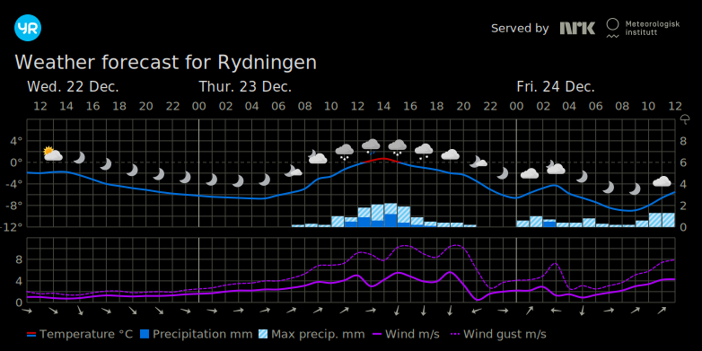

# Magic Mirror Module: mmm-weatherchart
This [MagicMirror2](https://github.com/MichMich/MagicMirror) module allows you to show a weather diagram provided by http://www.yr.no




## About

This builds on the module made by paphko, big thanks to him for creating it :)
The main difference is this fork uses the svg image from yr.no, which allows us to customise the look. Additionally, the image is much sharper because the browser can render everything nicely.

You can override the default styling, have a look at the defaults in `mmm-weatherchart.js` for the available values, and set your custom values in your magic mirror config.
We can also override the scaling, so you can have a giant forecast if you wish.


Because i am a newbie when it comes to node.js and manipulating svg, i just maintain these changes in a fork for now.
Hopefully someone with better knowledge would be willing to review or rewrite this properly and merge to his repo.

## Installation

In your terminal, go to your MagicMirror's Module folder:
````
cd ~/MagicMirror/modules
````

Clone this repository:
````
git clone https://github.com/paphko/mmm-weatherchart.git
````

Configure the module in your `config.js` file.

## Using the module

To use this module, you must first get the correct url for the location:

1. Navigate to http://www.yr.no
2. Search for the location you want forecast for
3. Navigate to the bottom of the table to find the link for "Forecast as SVG"
4. Click the link to open in it in a new tab, and copy the url., e.g.: https://www.yr.no/en/content/1-2826766/meteogram.svg

Ref: https://developer.yr.no/doc/guides/deprecating-old-widgets/

Now add the module to the modules array in the `config/config.js` file:
````javascript
modules: [
    {
        module: 'mmm-weatherchart',
        position: 'bottom_right', // this can be any of the regions
        config: {
		locationPath: "/en/content/1-2826766/meteogram.svg",
		updateInterval: 60 * 60 * 1000, // update every hour
		hideBorder: true, // whether or not a border with city name should be shown
		// mmDirectory: "/home/pi/MagicMirror/" // required for caching; adjust if it differs
        }
    },
]
````

## Configuration options

The following properties can be configured:


<table width="100%">
    <!-- why, markdown... -->
    <thead>
        <tr>
            <th>Option</th>
            <th width="100%">Description</th>
        </tr>
    <thead>
    <tbody>
        <tr>
            <td><code>locationPath</code></td>
            <td>Your url link (after www.yr.no) which determines your location to be shown.</td>
        </tr>
        <tr>
            <td><code>updateInterval</code></td>
            <td>Update interval of the diagram.
                <br><b>Default value:</b> <code>60 * 60 * 1000</code> (once every hour)
            </td>
        </tr>
        <tr>
            <td><code>hideBorder</code></td>
            <td>Wheather or not a border with city name should be shown.
                <br><b>Default value:</b> <code>true</code>
            </td>
        </tr>
        <tr>
            <td><code>mmDirectory</code></td>
            <td>To avoid the image to be cached by the browser (issue #5), it is downloaded into the magic mirror / modules / mmm-weatherchart / cache folder.
                I couldn't find a way to ask MM for this path, so I just hard-coded it here with the possibility to adjust it in case your installation looks different.
                <br><b>Default value:</b> <code>/home/pi/MagicMirror/</code>
            </td>
        </tr>
    </tbody>
</table>


Here are the extra values which can be configured.
```
        customiseSVG: true, // change colours in hex values or "default" for no change
        background_colour: "black", // background
        text_colour: "#d9d9d9", // text
        label_text_colour: "#f2f2f2", // label text color
        above_zero_line_colour: "#c60000", // templine color above 0
        below_zero_line_colour: "#006edb", // templine color below 0
        minor_gridline_colour: "#43443c", // gridline
        major_gridline_colour: "#9d9f93", // midnight line
        wind_line_colour: "#aa00f2", // windline
        rain_colour: "#0062bf", // raindrop
        snow_colour: "#ffffff", // snow
        moon_colour_a: "#afb3b6", // moonstart
        moon_colour_b: "#acafb3", // moonstop

        // properties to override the image size. 
        // to use them, set customize_size: true
        // these values should make the forecast full width on a full HD, 1080p screen in landscape orientation
        customize_size: false,           // whether to override the size of the forecast image. by default, just use the size from yr.no
        override_scale_factor: 2,        // forecast will be twice as big. 
        override_width: 1920,            // image canvas needs to be expanded to draw a bigger forecast.
        override_height: 550,            // as above
        override_x_location: 100,        // shift image horizontally
        override_y_location: 0           // shift image vertically
```
